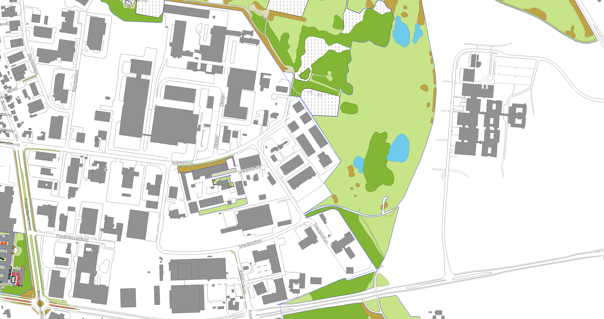

# Projekt 'Grøn Registrering'
Håndtering af grønne registreringer i Open Source
Version 2

Af
Casper Bertelsen, have- og parkingenigørstuderende

Kontakt: casperbj94@gmail.com

_____________________________________________

This program is free software: you can redistribute it and/or modify it under the terms of the GNU General Public License as published by the Free Software Foundation, either version 3 of the License, or (at your option) any later version.
This program is distributed in the hope that it will be useful, but WITHOUT ANY WARRANTY; without even the implied warranty of MERCHANTABILITY or FITNESS FOR A PARTICULAR PURPOSE. See the GNU General Public License for more details.
_____________________________________________

Version 1:

Original version fra Frederikssund Kommune

Udarbejdet
- i forbindelse med praktikophold Sept '16 - Jan '17
- i samarbejde med
	- Frederikssund Kommunes Vej & Park-afdeling
	- Bo Victor Thomsen, Frederikssund Kommunes GIS-afdeling

Version 2:

Udarbejdet i perioden Jan '17 og frem.

Alle filer er sat op til at være på localhost, og disse kan ændres til en anden server.

Se dokumentationen for mere information omkring projektet.